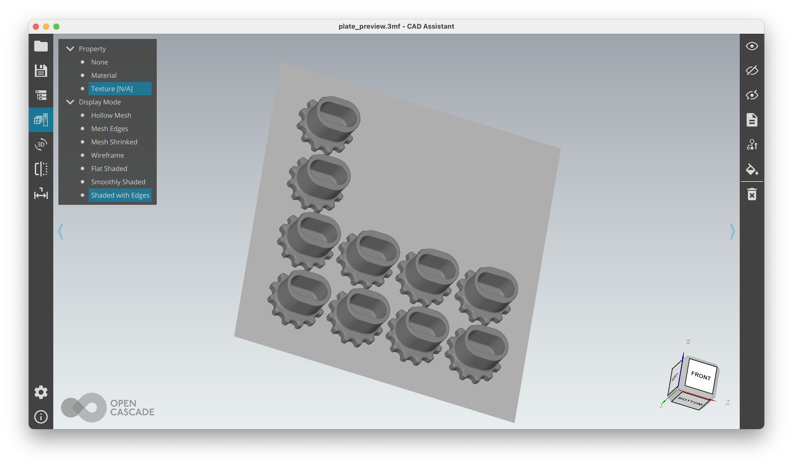
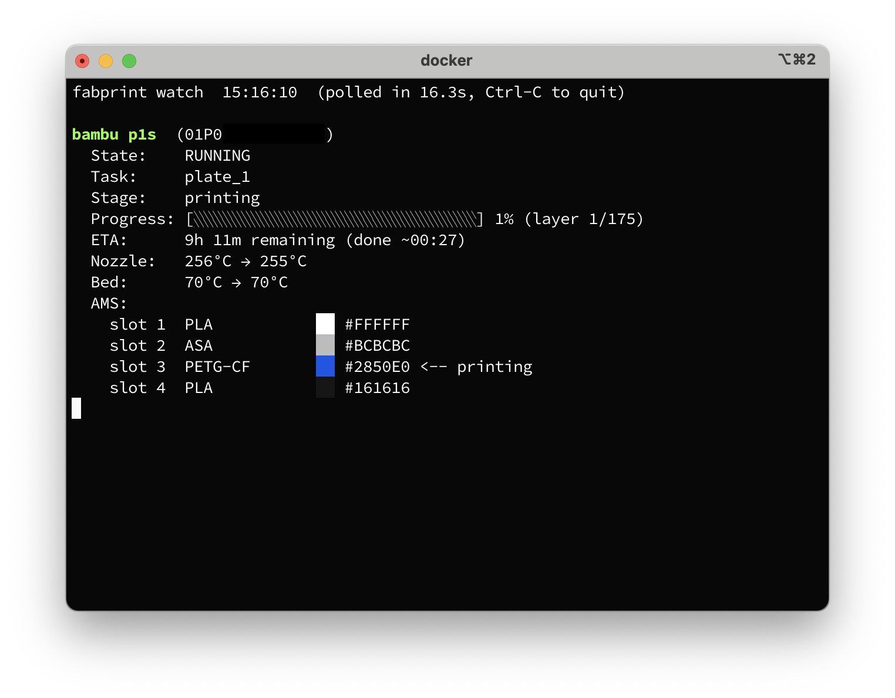

# fabprint

[](https://pypi.org/project/fabprint/)
[](https://github.com/pzfreo/fabprint/actions/workflows/ci.yml)
[](https://pypi.org/project/fabprint/)
[](LICENSE)

**Immutable 3D print pipeline**: arrange parts on a build plate, slice to gcode, and send to a Bambu Lab printer — all defined in a single TOML config file.


## Why fabprint?

Code-CAD tools like [build123d](https://github.com/gumyr/build123d), [OpenSCAD](https://openscad.org) and [cadquery](https://github.com/cadquery/cadquery) let you define physical parts in code — making designs parametric, testable, and version-controlled. But the moment you need to print, that workflow breaks: open a slicer GUI, drag in files, fiddle with settings, hit print. Hard to reproduce, no diffs, the only thing to track are binary project files.

fabprint is aiming to close that gap. Define your objects, filaments, slicer setting and printer targets in a straightforward TOML file. Use a CLI or CI pipeline to arrange, slice and send to the printer. Pin filament and printer profiles to capture the exact settings. Slicing happens in Docker for platform-agnostic reproducible builds. Everything is text, everything goes in git, and the same config produces the same print every time.

## Quick start

### 1. Install

```bash
pip install fabprint
```

### 2. Create `fabprint.toml`

```toml
[plate]
size = [256, 256]       # build plate dimensions in mm
padding = 5.0

[slicer]
engine = "orca"
printer = "Bambu Lab P1S 0.4 nozzle"
process = "0.20mm Standard @BBL X1C"

[[parts]]
file = "frame.stl"
filament = "Generic PETG-CF @base"

[[parts]]
file = "wheel.stl"
copies = 5
orient = "upright"
filament = "Generic PETG-CF @base"
```

Parts reference filament profiles by name — no need to manually number AMS slots.

### 3. Arrange, slice, print

```bash
fabprint plate fabprint.toml -o plate.3mf   # arrange parts onto a build plate
fabprint slice fabprint.toml                 # arrange and slice to gcode
fabprint print fabprint.toml                 # arrange, slice and send to printer
```

The `plate` command also generates a `plate_preview.3mf` with a bed outline — open it in any 3MF viewer to review placement:



## Features

- **Multi-format input** — STL, 3MF, and STEP files
- **Automatic orientation** — flat, upright, side, or custom rotations
- **Bin packing** — efficient 2D arrangement with configurable padding
- **Part scaling** — uniform scale factor per part
- **Multi-filament** — AMS slot assignment per part with correct extruder mapping
- **Slicer integration** — OrcaSlicer support
- **Profile management** — discover, pin, and override slicer profiles
- **Print delivery** — LAN, Bambu Connect, or cloud API
- **Docker support** — pre-built images with OrcaSlicer for reproducible CI/CD slicing
- **Cross-platform** — macOS, Linux, and Windows

## Installation

Requires Python 3.11+.

```bash
pip install fabprint
```

Or with [uv](https://docs.astral.sh/uv/):

```bash
uv pip install fabprint
```

### Optional extras

```bash
pip install "fabprint[lan]"    # LAN printing via MQTT/FTP
pip install "fabprint[cloud]"  # Bambu Cloud API (experimental)
pip install "fabprint[step]"   # STEP file support (build123d)
pip install "fabprint[all]"    # Everything
```

## CLI reference

```
fabprint plate <config>                     # Arrange and export 3MF (+ preview)
fabprint slice <config>                     # Arrange, export, and slice to gcode
fabprint print <config>                     # Arrange, slice, and send to printer
fabprint print <config> --dry-run           # Do everything except send to printer
fabprint print <config> --gcode plate.gcode # Send pre-sliced gcode
fabprint print <config> --upload-only       # Upload without starting print
fabprint print <config> --sequence 1        # Print only sequence 1
fabprint gcode-info plate.gcode             # Analyze extruder usage per layer
fabprint login                              # Log in to Bambu Cloud, cache token
fabprint watch                              # Live dashboard for all printers 
fabprint status                             # Query status of all printers
fabprint profiles list                      # List available slicer profiles
fabprint profiles pin <config>              # Pin profiles for reproducible builds
```



## Config reference

### `[printer]`

| Key           | Type     | Default       | Description                            |
|---------------|----------|---------------|----------------------------------------|
| `mode`        | `string` | `"bambu-lan"` | `"bambu-lan"`, `"bambu-connect"`, or `"bambu-cloud"` |
| `ip`          | `string` | —             | Printer IP address (LAN mode)          |
| `access_code` | `string` | —             | Printer access code (LAN mode)         |
| `serial`      | `string` | —             | Printer serial number (LAN mode)       |

**Printer modes:**

- **`bambu-lan`** — Direct LAN connection via MQTT + FTP. Requires `ip`, `access_code`, and `serial`. Fastest, works offline.
- **`bambu-connect`** — Sends sliced `.gcode.3mf` to the [Bambu Connect](https://wiki.bambulab.com/en/software/bambu-connect) app. No credentials needed; you confirm and start from the app.
- **`bambu-cloud`** — Experimental cloud API. Requires `BAMBU_EMAIL` and `BAMBU_PASSWORD` env vars.

**Environment variable overrides:**

| Env var            | Overrides             |
|--------------------|-----------------------|
| `BAMBU_PRINTER_IP` | `printer.ip`         |
| `BAMBU_ACCESS_CODE`| `printer.access_code` |
| `BAMBU_SERIAL`     | `printer.serial`     |
| `BAMBU_EMAIL`      | Cloud login email     |
| `BAMBU_PASSWORD`   | Cloud login password  |

### `[plate]`

| Key       | Type      | Default | Description              |
|-----------|-----------|---------|--------------------------|
| `size`    | `[w, h]`  | —       | Build plate size in mm   |
| `padding` | `float`   | `5.0`   | Gap between parts in mm  |

### `[slicer]`

| Key         | Type       | Default  | Description                            |
|-------------|------------|----------|----------------------------------------|
| `engine`    | `string`   | `"orca"` | `"orca"` or `"bambu"`                  |
| `version`   | `string`   | —        | Required OrcaSlicer version (e.g. `"2.3.1"`) |
| `printer`   | `string`   | —        | Printer profile name                   |
| `process`   | `string`   | —        | Process profile name                   |
| `filaments` | `[string]` | —        | Filament profiles (auto-derived from parts if omitted) |

### `[slicer.slots]`

Map slot numbers to filament profiles for explicit AMS placement:

```toml
[slicer.slots]
1 = "Generic PLA @base"
3 = "Generic PETG-CF @base"
5 = "Generic TPU @base"        # direct feed (bypass AMS)
```

Parts can use `filament = 3` to target a specific slot, or `filament = "Generic PLA @base"` to auto-assign.

### `[slicer.overrides]`

Key-value pairs applied on top of the process profile:

```toml
[slicer.overrides]
enable_support = 1
wall_loops = 4
curr_bed_type = "Textured PEI Plate"
```

Common bed types: `"Cool Plate"`, `"Engineering Plate"`, `"High Temp Plate"`, `"Textured PEI Plate"`.

### `[[parts]]`

| Key        | Type          | Default  | Description                          |
|------------|---------------|----------|--------------------------------------|
| `file`     | `string`      | —        | Path to mesh file (STL/3MF/STEP)     |
| `copies`   | `int`         | `1`      | Number of copies                     |
| `orient`   | `string`      | `"flat"` | `"flat"`, `"upright"`, or `"side"`   |
| `rotate`   | `[x, y, z]`  | —        | Custom rotation in degrees (overrides `orient`) |
| `filament` | `int\|string` | `1`      | Filament profile name or slot index  |
| `scale`    | `float`       | `1.0`    | Uniform scale factor                 |
| `object`   | `string`      | —        | Select a named object from a multi-object 3MF |
| `sequence` | `int`         | `1`      | Print order for sequential printing  |

### `[parts.filaments]`

Per-object filament overrides for multi-object 3MF files:

```toml
[[parts]]
file = "widget.3mf"
filament = "Generic PETG-CF @base"       # default for objects not listed

[parts.filaments]
inlay = "Bambu PLA Basic @BBL X1C"       # override for object named "inlay"
```

Objects are grouped as a single unit for bin packing.

## Sequential printing

For workflows like bottom inlay printing — print one object first (e.g. text inlay in PLA), then print the body on top (e.g. PETG-CF):

```toml
[[parts]]
file = "widget.3mf"
object = "inlay"
filament = "Generic PLA @base"
sequence = 1

[[parts]]
file = "widget.3mf"
object = "body"
filament = "Generic PETG-CF @base"
sequence = 2
```

Both objects come from the same 3MF, so fabprint guarantees identical bed positioning:

```bash
fabprint print fabprint.toml --sequence 1   # print the inlay
# wait for completion...
fabprint print fabprint.toml --sequence 2   # print the body on top
```

## Profile management

fabprint resolves slicer profiles in this order:

1. Direct file path (if the name contains `/` or `\`)
2. Pinned profiles in `<project>/profiles/<category>/`
3. Slicer system directory

Pin profiles to lock your build against slicer updates:

```bash
fabprint profiles pin fabprint.toml
```

Commit the `profiles/` directory to git for identical slicing across machines.

## Docker

Pre-built images with OrcaSlicer are available on [Docker Hub](https://hub.docker.com/r/fabprint/fabprint):

```bash
docker pull fabprint/fabprint:orca-2.3.1
```

Run from your project directory:

```bash
docker run --rm -v "$PWD:/project" fabprint/fabprint:orca-2.3.1 slice fabprint.toml
docker run --rm -v "$PWD:/project" fabprint/fabprint:orca-2.3.1 plate fabprint.toml -o plate.3mf
```

By default, fabprint uses Docker if available, falling back to a local slicer install:

```bash
fabprint slice fabprint.toml                  # Docker first, local fallback
fabprint slice fabprint.toml --local          # Force local slicer
fabprint slice fabprint.toml --docker-version 2.3.1  # Pin Docker image version
```

For fully reproducible builds, pin both profiles and the OrcaSlicer version:

```bash
fabprint profiles pin fabprint.toml
fabprint slice fabprint.toml --docker-version 2.3.1
```

To build your own image:

```bash
./scripts/build-docker.sh 2.3.2          # build only
./scripts/build-docker.sh 2.3.2 --push   # build and push
```

## Platform support

fabprint auto-detects slicer paths per platform:

| Platform | BambuStudio | OrcaSlicer |
|----------|-------------|------------|
| macOS    | `/Applications/BambuStudio.app/...` | `/Applications/OrcaSlicer.app/...` |
| Linux    | `/usr/bin/bambu-studio` | `/usr/bin/orca-slicer` |
| Windows  | `C:\Program Files\BambuStudio\...` | `C:\Program Files\OrcaSlicer\...` |

Slicers on PATH are also detected (Flatpak, Snap, custom installs). Profile directories follow platform conventions (`~/Library/Application Support/` on macOS, `~/.config/` on Linux, `%APPDATA%` on Windows).

## How it works

1. **Arrange** — loads meshes, orients them, and bin-packs onto the build plate
2. **Export** — writes a 3MF with per-object extruder metadata for correct AMS slot mapping
3. **Slice** — calls OrcaSlicer CLI to produce a Bambu Connect-compatible `.gcode.3mf`
4. **Post-process** — patches the sliced 3MF to fix metadata issues Bambu Connect requires (see [docs/gcode-3mf-format.md](docs/gcode-3mf-format.md))
5. **Send** — delivers to the printer via LAN, Bambu Connect, or cloud API

## Contributing

```bash
git clone https://github.com/pzfreo/fabprint.git
cd fabprint
uv sync --extra dev
uv run pytest              # run tests
uv run ruff check src tests     # lint
uv run ruff format src tests    # format
```

## License

Apache 2.0
